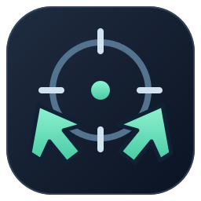

# Soy Scope

<p align="center"></p>

A Windows and KDE Linux overlay that puts the pointing soyjak's fingertip on your crosshair. Press **F8** to arm it, hold **right click** to show it after a short delay, and release right click to hide it. Enable **Use a different mouse button** in setup to use left click, middle click, or either side button instead.

The overlay is transparent, click-through, and positioned relative to the center of your primary display. The image and application icon are embedded in the executable.

[Download releases](https://github.com/aridlin/soy-scope/releases/latest) · [Report a bug](https://github.com/aridlin/soy-scope/issues)

## Quick start

1. Download `soy-scope-windows-x64.zip` from Releases and extract it into a writable folder.
2. Run `soy_scope.exe` or `Soy Scope GUI.cmd`.
3. Press **F8** to arm the right-click trigger.
4. Hold the right mouse button. The overlay appears after **250 ms**; releasing the button hides it immediately.
5. Press **F8** again to disarm it.

Use the setup window to change the image, hotkey, trigger button, delay, size, opacity, or fingertip anchor. Settings apply while the app runs. **Save config** writes them to `soy-scope.ini` beside the executable; closing the app also saves them.

## GUI and TUI

Both interfaces are included in the same executable:

```powershell
# Native graphical setup
.\soy_scope.exe --ft-gui

# Terminal setup; run inside a terminal
.\soy_scope.exe --ft-tui
```

The release includes launchers for both. The TUI changes the setup interface; the overlay still appears on the Windows desktop. FT also exposes `--ft-web`, but the normal entry points documented here are GUI and TUI.

## Controls and defaults

| Setting | Default | Purpose |
| --- | --- | --- |
| Hotkey | `F8` | Toggle the selected mouse trigger |
| Trigger button | Right mouse button | Check **Use a different mouse button** and select left, middle, X1, or X2 |
| Delay | `250 ms` | Wait before showing the overlay |
| Width | `1200 px` | Scale the overlay image |
| Opacity | `0.72` | Set overlay transparency |
| Anchor X / Y | `57.5% / 37.5%` | Place this point in the image at the primary screen's center |
| Image | Embedded pointing soyjaks | No separate asset file needed |

- **Browse image** selects a WebP, PNG, JPEG, or BMP supported by the installed Windows image decoder.
- **Use embedded** restores the included image.
- **Show if armed** previews the overlay when armed; **Hide** hides it.
- **Reset anchor** restores the default fingertip position.
- Hotkey examples: `F8`, `Ctrl+Alt+S`, `Shift+F9`. Choose another key if another app owns the hotkey.

Unchecking **Use a different mouse button** restores right-click. Changing the trigger hides the overlay and cancels its pending delay; release and press the newly selected button to use it. The checkbox and button choice are saved with the other settings.

See [`soy-scope.example.ini`](soy-scope.example.ini) for the configuration format. Copy it to `soy-scope.ini` to configure the app by hand.

## Optional Medal markers

Check **Enable Medal markers**, then choose either or both:

- **Mark every aim** sends one shortcut when the overlay appears after its delay. A short aim that ends before the delay, and the **Show if armed** preview, do not create markers.
- **Mark with a separate key** uses **F9** by default. It works even when the overlay is disarmed or its trigger is disabled; holding the key does not repeat markers.

Set **Medal clip/bookmark shortcut** to match Medal's recording settings. Soyscope defaults this to **F10**, so set Medal's shortcut to F10 too, or choose another matching shortcut. Keep the base keys for the overlay toggle (F8), manual marker (F9), and Medal shortcut (F10) distinct. Modifier combinations such as `Ctrl+Alt+M` are supported. Settings are saved with the other preferences; existing configurations leave Medal markers off.

Use Medal's **Long Recording** mode for timeline bookmarks. In clip mode the same shortcut saves a clip instead. See [Medal's bookmark documentation](https://support.medal.tv/support/solutions/articles/48001159728).

This integration sends a Windows keyboard shortcut, not a confirmed Medal API event. The status reports whether Windows accepted the input; it cannot confirm Medal received it. Medal must be running and recording, and simulated-input compatibility has not been verified against Medal on Windows. The shortcut also reaches the foreground application, so use a binding that does not perform an unwanted game action. Windows can block input to applications running with higher privileges.

Soyscope waits up to two seconds for unrelated held modifiers or the target key to be released, then skips that marker if they remain held. Requests arriving while a marker is queued or its 50 ms keypress is in progress are combined into that marker. Changing these settings cancels pending markers and releases injected keys.

## Build from source

Requires Windows x64, CMake 3.20+, Visual Studio 2022 Build Tools with **Desktop development with C++**, and a Windows SDK.

```powershell
git clone https://github.com/aridlin/soy-scope.git
cd soy-scope
cmake -S . -B build -G "Visual Studio 17 2022" -A x64
cmake --build build --config Release --parallel
.\build\Release\soy_scope.exe --ft-gui
```

The app uses C++17, Win32, Direct3D 11, DirectComposition, Direct2D, and Windows Imaging Component. The MSVC runtime is linked statically. FT is vendored, so no package manager or separate UI-library download is needed. GitHub Actions builds the Windows executable on pushes and pull requests.

## Input logic tests

On Linux with Python 3 and a C++17 compiler:

```sh
python3 tests/test_medal.py
```

These tests run the production configuration parser and Medal state machine against deterministic Win32 input stubs. They cover modes, persistence, shortcut conflicts, cancellation, held modifiers, key release, and input failures. GitHub Actions runs them alongside the native Windows build. They do not verify Medal receiving bookmarks or physical input.

## How it works

The setup interface sends settings to a separate overlay controller. A global hotkey arms the trigger, mouse-button polling detects the selected mouse button's state, and a timer handles the delay. The image is prepared ahead of display; DirectComposition controls its visibility and opacity. This is a desktop overlay with no game-specific integration.

## Limitations

- The Windows overlay targets the primary display; Linux supports monitor selection.
- Use a writable folder to save settings.
- Exclusive fullscreen or an application's overlay restrictions may prevent a desktop overlay from appearing. Compatibility with individual games has not been verified.
- CI checks compilation; it does not test physical mouse input, hotkeys, or visual alignment.

## Project layout and notices

`src/main.cpp` contains the app and overlay controller; `vendor/` contains FT; `resources/` embeds the image and icon from `assets/`.

See [third-party notices](THIRD_PARTY_NOTICES.md). No project-wide license has been added; public availability alone does not grant a license to redistribute third-party artwork.


## Linux / KDE Plasma 6

A native Linux port is included with FT desktop setup, TUI and local web setup, Wayland
layer-shell and X11 overlays, persistent settings and optional recorder markers.
See [Linux build, dependencies and usage](linux/README.md). Linux releases target
Arch/CachyOS x86-64; other distributions can build from source. The Windows and
Linux backends remain separate so their platform integrations stay intact.
